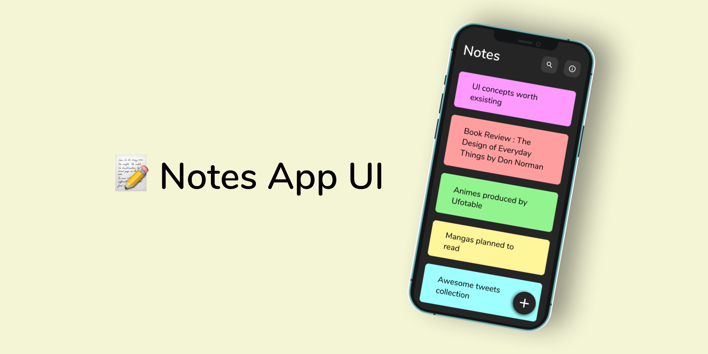

# Notes App UI Design

Figma mobile app designed by [Notes App UI]([https://www.figma.com/@techcrowd](https://www.figma.com/file/IjQ4IjGGLiSa63yq6qxgex/Notes-App-UI-(Community)?type=design&node-id=184-179&mode=design&t=Fpl5d4urmOfdU2Wx-0)) on Figma

This is the UI implementation of the mobile design in Ionic 6 Angular 14



## Installation

For the installation, you will need node and angular pre-installed to get started!

```bash

npm install -g @ionic/cli

```

## Usage

```python

#for running the app browser

ionic serve

##for adding Android or IOS platform

npm i @capacitor/android @capacitor/ios

## Adding platform folders

npx cap add android
npx cap add ios

## for build folder

ionic build --prod

## syncing the changes to the platform folder

npx cap sync


```

## Contributing

Pull requests are welcome. Please open an issue to discuss what you would like to change for significant changes.

## License

MIT
